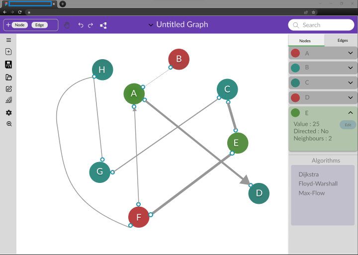

# Project Khayal

This project aims to develop hands-on experience with open source by building an open-source interactive graph editing tool.

## Wireframe

## Milestones

As of 20 June, 2022, the milestones are as follows. These will be revised as the project proceeds.
1. Complete the requirements document.
1. Form a team of contributors.
1. Build a proof of concept.
1. Apply for HU research grant.
1. Proceed with the project.

## Requirements

Below are the assorted requirements as of now.
1. Handle a graph of up to 100 vertices.
1. Handle a graph of up to 1M vertices.
1. Build a wire frame of the application.
1. Perform timing tests to optimize the run time.
1. Investigate layout alligators for graph visualization.
1. Choose the implementation language.
1. Implement GPU support.
1. Build a testing environment.
1. Incorporate CI/CD.
1. Investigate hosting options.
1. Finalize a development environment.

